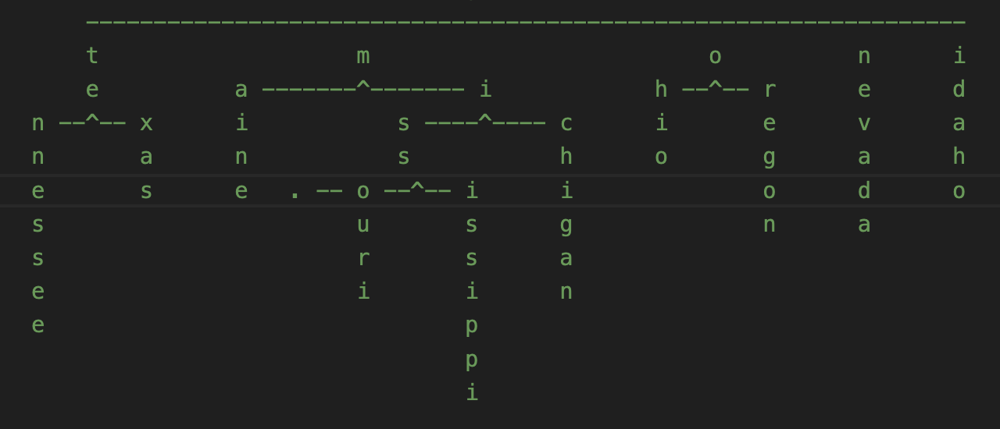

# Trie JS

  </img>

# Introduction

**Trie JS** is a sortable trie data structure for arranging any sequential data type for a speedy search and retrieval

### Name:

<strong>@webkrafters/trie</strong> 
<strong>Alternate:</strong> trie.js

# Installation

npm install --save @webkrafters/trie

# Usage

Please see complete documentation here: 

[https://github.com/webKrafters/trie.js/blob/master/docs.md](https://github.com/webKrafters/trie.js/blob/master/docs.md)

For a compressed trie implementation, see: 

[Radix Trie JS](https://github.com/webKrafters/radix-trie.js/blob/master/README.md)

# License
MIT

