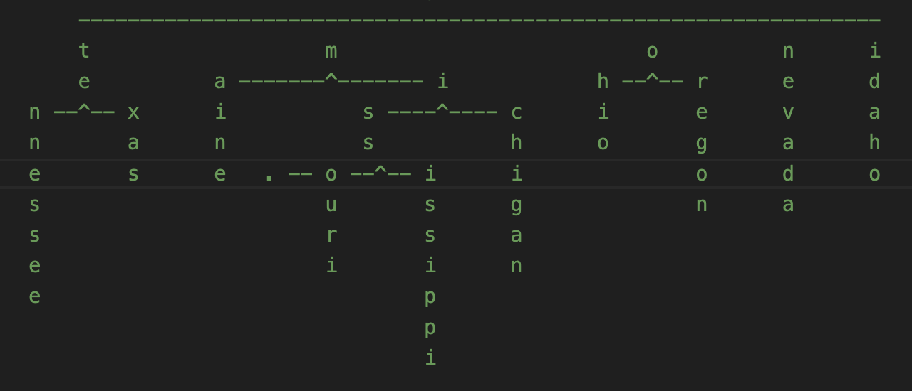

# Trie JS

<p align="center">
  </img>
</p>

# Introduction

**Trie JS** is a trie data structure for arranging any sequential data type for a speedy search and retrieval

### Name:

<strong>@webkrafters/trie</strong><br />
<strong>Alternate:</strong> trie.js

# Installation

npm install --save @webkrafters/trie

# Usage

## Constructor (4 Overloads)
```tsx
1. constructor(data?: Trie<T>, opts?: Options<T>);
```
```tsx
2. constructor(data?: TrieableNode<T>, opts?: Options<T>);
```
```tsx
3. constructor(data?: Array<TrieableNode<T>>, opts?: Options<T>);
```
```tsx
4. constructor( data?: Array<Array<T>>, opts?: Options<T>);
```
<p>
To create an instance of this Trie with the following data:<br />
<code>[ 'Tennessee', 'MI', Nevada', 'Texas', 'Oregon', 'Michigan' ]</code>,<br />
use the `constructor #4` like so:
</p>

```tsx
const trie = new Trie<string>([
    [ 't', 'e', 'n', 'n', 'e', 's', 's', 'e', 'e' ],
    [ 'm', 'i' ],
    [ 't', 'e', 'x', 'a', 's' ],
    [ 'o', 'r', 'e', 'g', 'o', 'n' ],
    [ 'm', 'i', 'c', 'h', 'i', 'g', 'a', 'n' ]
]); 
```
## Properties

### isEmpty
#### readonly
<p>Confirms if this instance contains any complete in it.</p>

```tsx
isEmpty: boolean
```
### size
#### readonly
<p>Produces the number of complete sequences in this instance.</p>

```tsx
size: number
```
## Methods
### add
<p>Accepts a sequence of items to merge into this instance.</p>

```tsx
add( data: Array<T> ): void
```
### addMany
<p>Accepts sequences of items and TrieableNodes or a combination thereof to merge into this instance.</p>

```tsx
addMany( data : Array<Array<T>|TrieableNode<T>> ): void
```
### asArray
<p>Produces all complete sequences in this instance as an array of sequential data.</p>

```tsx
asArray(): Array<Array<T>> 
```
### asTrieableNode
<p>Produces the data in this instance as a TrieableNode.</p>

```tsx
asTrieableNode(): TrieableNode<T>
```
### clear
<p>Clears all data contained in this instance.</p>

```tsx
clear(): void
```
### clone
<p>Creates a deep clone of this instance.</p> 

```tsx
clone(): Trie<T>
```
### getAllStartingWith

<p>
Produces all complete sequences that begins with the prefix sequence.
</p>
<p>
<strong>Note:</strong><br /> 
Produces up to and including the prefix sequence if found to be a complete sequence within this instance.
</p>
<p>
<strong>Note:</strong><br /> 
An empty prefix sequence will produce an empty array.
</p>

```tsx
getAllStartingWith( prefix: Array<T> ): Array<Array<T>>
```
### has
<p>
Confirms that a complete matching sequence exists in this instance. 
</p>

```tsx
has( sequence : Array<T> ): boolean
```
### isSame
<p>
 Confirms that the trie is this instance.
 </p>

```tsx
isSame( trie: Trie<T> ): boolean
```
### matches (4 Overloads)
<p>
Confirms that the supplied graph is a data equivalent of this instance.
</p>

```tsx
1. matches( graph : Array<Array<T>> ): boolean
```
```tsx
2. matches( graph : Array<TrieableNode<T>> ): boolean
```
```tsx
3. matches( graph : TrieableNode<T> ): boolean
```
```tsx
4. matches( graph : Trie<T> ): boolean
```
### merge (2 Overloads)
<p>
Merges data into tree data into this instance.
</p>

```tsx
1. merge( data : Trie<T> ): void
```
```tsx
2. merge( data : TrieableNode<T> ): void
```
### remove
<p>
Accepts a sequence of items to remove from this instance if a matchign complete sequence located.
Returns <code>true</code> if found and removed.
</p>

```tsx
 remove( data: Array<T> ): boolean
```
### removeAllStartingWith
<p>
Removes all complete sequences that begins with the prefix sequence.
</p>
<p>
<strong>Note:</strong><br />
Removes up to and including the prefix sequence if found to be a complete sequence within this instance.
</p>
<p>
<strong>Note:</strong><br />
An empty prefix sequence will result in no removal.
</p>

```tsx
removeAllStartingWith(prefix : Array<T>): void
```

### removeMany
<p>
Accepts sequences of items to remove from the trie. Will record the outcome of the removal operation for each sequence:
</p>
<p>
<code>SUCCESSFUL</code> if found and removed and <code>FAILED</code> if a complete sequence matching this data was not located in this instance.
</p>

```tsx
removeMany(data : Array<Array<T>>): Array<OpStatus>
```

## Static

### makeTrieable
<p>Converts any nested object by applying a keyMapping to a TrieableNode which could be converted into a Trie instance.</p>

```tsx
makeTrieable<T>(
    node: NESTED_OBJECT,
    keyMap: TrieableNodeKeyMapping,
    parentNode: TrieableNode<T>
): TrieableNode<T>
```
<p>
A TrieableNode<T> mapping to a complete Trie<T> instance has the following root node shape:
</p>

```tsx
{
    data: null, // <--- notice the `null` value for this property at the root level.
    children?: Array<TrieableNode<T>>,
    isBoundary?: boolean,
    parent?: any
}  
```
<p>Here is a sample call:</p>

```tsx
// assuming the following nested object to convert 
const nested = {
    x: {
        w: true,
        x: {
            y: 11,
            k: 'A'
        },
        y: 22,
        z: {
            y: 99,
            x: {
                w: true,
                y: 77,
                a: 43,
                x: 760
            }
        }
    },
    y: 55,
    z: 'testing'
};
/* assuming the following keyMap please see more on keyMap in the next subsection. */
const keyMap = {
    children: [ 'x', 'z' ],
    data: 'y',
    isBoundary: 'w'
}
const trieableNode = Trie.makeTrieable( nested, keyMap );
//  => {
//     data: 55,
//     children: [{
//         data: 22,
//         isBoundary: true,
//         children: [{
//             data: 11,
//             parent: <ref 1>
//         }, {
//             data: 99,
//             children: [{
//                  isBoundary: true,
//                  data: 77,
//                  children: [
//                      { data: 760, parent: <ref 1> },
//                      { data: null, parent: <ref 1> }
//                  ],
//                  parent: <ref 1>
//             }, {
//                  data: null,
//                  parent: <ref 1>
//             }],
//             parent: <ref 1>
//         }]
//     }, {
//          data: 'testing',
//          parent: <ref 1>
//     }],
//     parent: null
// };

```
<strong><u>More on the KeyMap object:</u></strong><br />
<p>The <code>KeyMap</code> object maps properties in the nested object to corresponding TrieableNode properties.</p>
<p><code>KeyMap.children</code> can be:
<ol>either an ordered array containing various names of individual properties within the nested object to combine into an array as the children of a TrieableNode</ol>
<ol>or a single value holding the name of a property within the nested object with either a single value or an iterable to be transfered into the children property of a TrieableNode.</ol>
</p> 

# License
MIT

